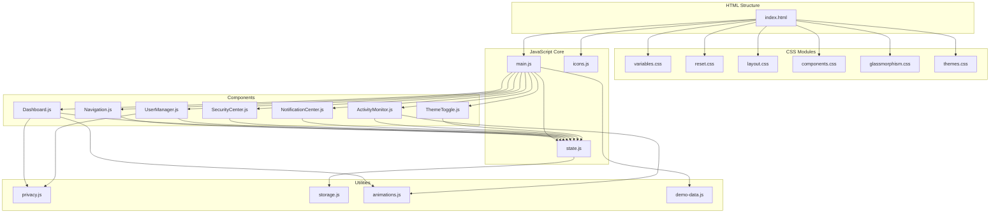
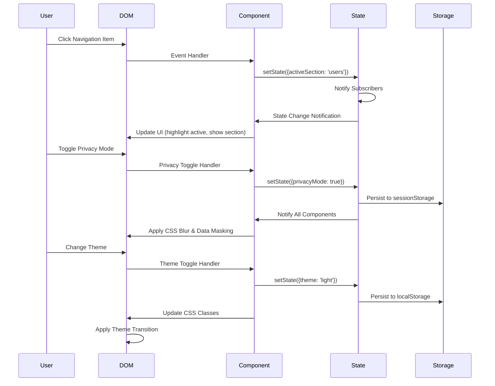

# Design Document: Modern Admin Panel

## Overview

The Modern Admin Panel is a privacy-first, single-page HTML/CSS/JavaScript admin dashboard featuring glassmorphism design, dark theme by default, and built-in data anonymization capabilities. The application is a demo version showcasing modern admin interface trends with emphasis on security and user privacy.

### Key Design Principles

1. **Privacy-First Architecture**: All sensitive data can be instantly masked or anonymized through a global privacy mode toggle
2. **Pure Frontend Implementation**: No backend dependencies - pure HTML/CSS/JavaScript with localStorage for persistence
3. **Glassmorphism Visual Design**: Modern frosted glass aesthetic using CSS backdrop-filter and layered transparency
4. **Component-Based Structure**: Modular JavaScript components with clear separation of concerns
5. **Performance-Optimized**: Inline SVG sprite system, CSS transforms for animations, lazy initialization

### Technology Stack

- **HTML5**: Semantic markup with ARIA attributes for accessibility
- **CSS3**: Custom properties (CSS variables) for theming, Grid and Flexbox for layouts, backdrop-filter for glassmorphism
- **Vanilla JavaScript**: ES6+ modules, DOM manipulation, event delegation, no frameworks
- **SVG Icons**: Inline sprite sheet for optimal performance
- **LocalStorage API**: Theme and privacy mode persistence

## Architecture

### Application Structure


```
modern-admin-panel/
├── index.html              # Main HTML structure
├── styles/
│   ├── variables.css       # CSS custom properties (colors, spacing, typography)
│   ├── reset.css          # CSS reset and base styles
│   ├── layout.css         # Grid/flexbox layouts, responsiveness
│   ├── components.css     # Component-specific styles
│   ├── glassmorphism.css  # Glassmorphism effects and utilities
│   └── themes.css         # Dark/light theme definitions
├── scripts/
│   ├── main.js            # Application initialization and routing
│   ├── state.js           # Global state management
│   ├── components/
│   │   ├── Navigation.js      # Sidebar navigation component
│   │   ├── Dashboard.js       # Dashboard with metrics
│   │   ├── UserManager.js     # User management table
│   │   ├── SecurityCenter.js  # Security monitoring
│   │   ├── NotificationCenter.js  # Notifications dropdown
│   │   ├── ActivityMonitor.js     # Live activity feed
│   │   └── ThemeToggle.js     # Theme switcher
│   ├── utils/
│   │   ├── privacy.js         # Data anonymization utilities
│   │   ├── storage.js         # LocalStorage wrapper
│   │   ├── animations.js      # Animation utilities
│   │   └── demo-data.js       # Demo data generators
│   └── icons.js           # SVG icon sprite definitions
└── assets/
    └── (optional images for backgrounds)
```

### Component Architecture Pattern

Each component follows a consistent structure:

```javascript
// Component structure pattern
class ComponentName {
  constructor(container, state) {
    this.container = container;
    this.state = state;
    this.init();
  }
  
  init() {
    this.render();
    this.attachEventListeners();
  }
  
  render() {
    // Generate and inject HTML
  }
  
  attachEventListeners() {
    // Bind event handlers
  }
  
  update(newData) {
    // Update component state and re-render
  }
  
  destroy() {
    // Cleanup event listeners
  }
}
```

### State Management

Global application state managed through a centralized State object:

```javascript
const AppState = {
  theme: 'dark',                    // 'dark' | 'light'
  privacyMode: false,               // boolean
  activeSection: 'dashboard',       // current view
  notifications: [],                // notification array
  users: [],                        // user data
  activities: [],                   // activity log
  metrics: {},                      // dashboard metrics
  
  subscribers: new Set(),           // state change listeners
  
  subscribe(callback) { /* ... */ },
  notify() { /* ... */ },
  setState(updates) { /* ... */ }
};
```

### Data Flow

1. **Initialization**: `main.js` loads state from localStorage, generates demo data, initializes components
2. **User Interaction**: Events trigger component methods
3. **State Update**: Component calls `AppState.setState()`, which triggers notifications
4. **Re-render**: Subscribed components receive updates and re-render affected parts
5. **Persistence**: Critical state (theme, privacyMode) saved to localStorage

## Components and Interfaces

### 1. Navigation Sidebar Component

**Purpose**: Primary navigation menu with collapsible behavior on mobile

**HTML Structure**:
```html
<nav class="sidebar" id="sidebar">
  <div class="sidebar-header">
    <svg class="logo-icon"><!-- Shield icon --></svg>
    <h1 class="sidebar-title">Admin Panel</h1>
  </div>
  <ul class="nav-menu">
    <li class="nav-item active" data-section="dashboard">
      <svg class="nav-icon"><use href="#icon-dashboard"/></svg>
      <span class="nav-label">Dashboard</span>
    </li>
    <!-- Additional nav items -->
  </ul>
  <button class="sidebar-collapse-btn" aria-label="Toggle sidebar">
    <svg><use href="#icon-chevron-left"/></svg>
  </button>
</nav>
```

**JavaScript Interface**:
```javascript
class Navigation {
  constructor(container, state);
  setActive(sectionId);           // Highlight active section
  toggleCollapse();               // Collapse/expand sidebar
  handleNavClick(event);          // Navigation event handler
}
```

**CSS Key Features**:
- Fixed position on desktop, slide-in overlay on mobile
- Glassmorphism background: `backdrop-filter: blur(20px); background: rgba(255,255,255,0.1);`
- Smooth collapse animation using CSS transforms
- Active state: accent color border-left and background tint


### 2. Dashboard Component

**Purpose**: Display key system metrics and analytics widgets

**HTML Structure**:
```html
<section class="dashboard-view" id="dashboard">
  <header class="view-header">
    <h2>Dashboard Overview</h2>
    <div class="header-actions">
      <button class="privacy-toggle" id="privacyToggle">
        <svg><use href="#icon-eye-off"/></svg>
        Privacy Mode
      </button>
      <button class="theme-toggle" id="themeToggle">
        <svg><use href="#icon-sun"/></svg>
      </button>
    </div>
  </header>
  
  <div class="metrics-grid">
    <div class="metric-card glass-effect">
      <div class="metric-icon-wrapper">
        <svg><use href="#icon-users"/></svg>
      </div>
      <div class="metric-content">
        <span class="metric-label">Total Users</span>
        <span class="metric-value" data-privacy="none">1,284</span>
        <span class="metric-change positive">+12.5%</span>
      </div>
    </div>
    <!-- Additional metric cards -->
  </div>
  
  <div class="analytics-widget glass-effect">
    <h3>Activity Trends</h3>
    <div class="chart-placeholder">
      <!-- Simple CSS-based bar chart or canvas chart -->
    </div>
  </div>
</section>
```

**JavaScript Interface**:
```javascript
class Dashboard {
  constructor(container, state);
  renderMetrics(metrics);         // Display metric cards
  animateMetricChange(element);   // Animate value updates
  updateChart(data);              // Update analytics visualization
}
```

**Metric Card Animation Algorithm**:
```javascript
function animateMetricValue(element, from, to, duration = 1000) {
  const startTime = performance.now();
  const range = to - from;
  
  function update(currentTime) {
    const elapsed = currentTime - startTime;
    const progress = Math.min(elapsed / duration, 1);
    const eased = easeOutCubic(progress);
    const current = Math.floor(from + (range * eased));
    element.textContent = current.toLocaleString();
    
    if (progress < 1) {
      requestAnimationFrame(update);
    }
  }
  
  requestAnimationFrame(update);
}

function easeOutCubic(t) {
  return 1 - Math.pow(1 - t, 3);
}
```

### 3. User Manager Component

**Purpose**: Display and manage user data with privacy controls

**HTML Structure**:
```html
<section class="user-manager-view" id="users">
  <div class="table-controls">
    <input type="search" class="search-input" placeholder="Search users...">
    <div class="filter-buttons">
      <button class="filter-btn active" data-filter="all">All</button>
      <button class="filter-btn" data-filter="active">Active</button>
      <button class="filter-btn" data-filter="inactive">Inactive</button>
    </div>
  </div>
  
  <table class="user-table glass-effect">
    <thead>
      <tr>
        <th>ID</th>
        <th>Email</th>
        <th>Role</th>
        <th>Status</th>
        <th>Last Activity</th>
        <th>Actions</th>
      </tr>
    </thead>
    <tbody id="userTableBody">
      <!-- Dynamically generated rows -->
    </tbody>
  </table>
  
  <div class="user-detail-panel glass-effect" id="userDetailPanel">
    <!-- Shown on row click -->
  </div>
</section>
```

**JavaScript Interface**:
```javascript
class UserManager {
  constructor(container, state);
  renderUsers(users);             // Render user table rows
  filterUsers(filterType);        // Apply status filter
  searchUsers(query);             // Filter by search term
  showUserDetail(userId);         // Display detail panel
  applyPrivacyMode(enabled);      // Mask/unmask sensitive data
}
```

**Privacy Mode Data Transformation**:
```javascript
function anonymizeUserData(user, privacyEnabled) {
  if (!privacyEnabled) return user;
  
  return {
    ...user,
    email: anonymizeEmail(user.email),
    id: `USR-${hashCode(user.id).toString(36).toUpperCase()}`,
    lastActivity: user.lastActivity // Keep timestamps
  };
}

function anonymizeEmail(email) {
  const [local, domain] = email.split('@');
  const maskedLocal = local[0] + '*'.repeat(local.length - 1);
  const [domainName, tld] = domain.split('.');
  const maskedDomain = domainName[0] + '*'.repeat(domainName.length - 1);
  return `${maskedLocal}@${maskedDomain}.${tld}`;
}

function hashCode(str) {
  return str.split('').reduce((hash, char) => {
    return ((hash << 5) - hash) + char.charCodeAt(0);
  }, 0);
}
```

### 4. Security Center Component

**Purpose**: Monitor security status and manage security settings

**HTML Structure**:
```html
<section class="security-view" id="security">
  <div class="security-status glass-effect" data-status="secure">
    <svg class="status-icon"><use href="#icon-shield-check"/></svg>
    <h3>System Status: <span class="status-text">Secure</span></h3>
    <p class="status-description">All systems operational</p>
  </div>
  
  <div class="security-events glass-effect">
    <h3>Recent Security Events</h3>
    <ul class="event-list" id="securityEventList">
      <!-- Security events -->
    </ul>
  </div>
  
  <div class="security-controls glass-effect">
    <h3>Security Settings</h3>
    <div class="control-item">
      <label class="switch">
        <input type="checkbox" id="twoFactorAuth" checked>
        <span class="slider"></span>
      </label>
      <span class="control-label">Two-Factor Authentication</span>
    </div>
    <!-- Additional controls -->
  </div>
  
  <div class="active-sessions glass-effect">
    <h3>Active Sessions</h3>
    <ul class="session-list" id="sessionList">
      <!-- Active sessions with terminate buttons -->
    </ul>
  </div>
</section>
```

**JavaScript Interface**:
```javascript
class SecurityCenter {
  constructor(container, state);
  updateStatus(status);           // 'secure' | 'warning' | 'critical'
  addSecurityEvent(event);        // Add new security event
  renderSessions(sessions);       // Display active sessions
  terminateSession(sessionId);    // End a session
}
```

**Security Status Color Mapping**:
- **Secure**: Green (#10b981), shield-check icon
- **Warning**: Yellow (#f59e0b), alert-triangle icon
- **Critical**: Red (#ef4444), alert-octagon icon

### 5. Notification Center Component

**Purpose**: Dropdown notification system with categorization

**HTML Structure**:
```html
<div class="notification-trigger">
  <button class="icon-button" id="notificationBtn">
    <svg><use href="#icon-bell"/></svg>
    <span class="notification-badge" id="notificationBadge">3</span>
  </button>
</div>

<div class="notification-dropdown glass-effect" id="notificationDropdown">
  <header class="dropdown-header">
    <h3>Notifications</h3>
    <button class="text-button">Mark all read</button>
  </header>
  <ul class="notification-list">
    <li class="notification-item unread" data-type="warning">
      <svg class="notification-icon"><use href="#icon-alert-triangle"/></svg>
      <div class="notification-content">
        <p class="notification-message">High CPU usage detected</p>
        <span class="notification-time">5 minutes ago</span>
      </div>
    </li>
    <!-- Additional notifications -->
  </ul>
</div>
```

**JavaScript Interface**:
```javascript
class NotificationCenter {
  constructor(container, state);
  toggle();                       // Show/hide dropdown
  addNotification(notification);  // Add new notification
  markAsRead(notificationId);     // Mark single as read
  markAllRead();                  // Mark all as read
  updateBadge();                  // Update unread count
}
```

**Notification Type Mapping**:
- **info**: Blue icon, informational messages
- **success**: Green icon, successful operations
- **warning**: Yellow icon, warnings requiring attention
- **error**: Red icon, critical errors

**Relative Time Algorithm**:
```javascript
function getRelativeTime(timestamp) {
  const now = Date.now();
  const diff = now - timestamp;
  
  const minute = 60 * 1000;
  const hour = 60 * minute;
  const day = 24 * hour;
  
  if (diff < minute) return 'just now';
  if (diff < hour) return `${Math.floor(diff / minute)} minutes ago`;
  if (diff < day) return `${Math.floor(diff / hour)} hours ago`;
  return `${Math.floor(diff / day)} days ago`;
}
```

### 6. Activity Monitor Component

**Purpose**: Real-time activity feed with event streaming

**HTML Structure**:
```html
<div class="activity-monitor glass-effect">
  <h3>Live Activity</h3>
  <ul class="activity-feed" id="activityFeed">
    <li class="activity-item" data-type="user_login">
      <svg class="activity-icon"><use href="#icon-user"/></svg>
      <div class="activity-content">
        <span class="activity-message">User logged in</span>
        <span class="activity-time">2 seconds ago</span>
      </div>
    </li>
    <!-- Limited to 10 most recent -->
  </ul>
</div>
```

**JavaScript Interface**:
```javascript
class ActivityMonitor {
  constructor(container, state);
  addActivity(activity);          // Add new activity with animation
  pruneOldActivities();           // Keep only recent 10
  startSimulation();              // Generate demo activities
  stopSimulation();               // Stop demo generation
}
```

**Activity Addition Animation**:
```javascript
function addActivityWithAnimation(activity) {
  const item = createActivityElement(activity);
  item.style.opacity = '0';
  item.style.transform = 'translateX(-20px)';
  
  this.feedElement.insertBefore(item, this.feedElement.firstChild);
  
  // Trigger reflow
  item.offsetHeight;
  
  item.style.transition = 'opacity 0.3s ease, transform 0.3s ease';
  item.style.opacity = '1';
  item.style.transform = 'translateX(0)';
  
  // Prune if exceeds 10 items
  if (this.feedElement.children.length > 10) {
    const lastItem = this.feedElement.lastChild;
    lastItem.style.opacity = '0';
    setTimeout(() => lastItem.remove(), 300);
  }
}
```

### 7. Theme Toggle Component

**Purpose**: Switch between dark and light themes

**JavaScript Interface**:
```javascript
class ThemeToggle {
  constructor(buttonElement, state);
  toggle();                       // Switch theme
  applyTheme(theme);              // Apply theme to document
  persistTheme(theme);            // Save to localStorage
}
```

**Theme Application Algorithm**:
```javascript
function applyTheme(theme) {
  // Remove existing theme
  document.documentElement.classList.remove('theme-dark', 'theme-light');
  
  // Add new theme class
  document.documentElement.classList.add(`theme-${theme}`);
  
  // Update icon
  const icon = this.button.querySelector('use');
  icon.setAttribute('href', theme === 'dark' ? '#icon-sun' : '#icon-moon');
  
  // Persist
  localStorage.setItem('admin-panel-theme', theme);
  
  // Notify state
  this.state.setState({ theme });
}
```

## Data Models

### User Model

```javascript
{
  id: string,                     // Unique identifier (e.g., "user_123")
  email: string,                  // User email address
  role: 'admin' | 'user' | 'moderator',
  status: 'active' | 'inactive' | 'suspended',
  lastActivity: number,           // Unix timestamp
  createdAt: number,              // Unix timestamp
  sessionsCount: number,          // Active sessions
  
  // Privacy-transformed version
  anonymized: boolean             // Flag indicating anonymization
}
```

### Notification Model

```javascript
{
  id: string,                     // Unique identifier
  type: 'info' | 'success' | 'warning' | 'error',
  message: string,                // Notification text
  timestamp: number,              // Unix timestamp
  read: boolean,                  // Read status
  actionUrl?: string              // Optional action link
}
```

### Activity Event Model

```javascript
{
  id: string,                     // Unique identifier
  type: 'user_login' | 'user_logout' | 'data_export' | 'settings_changed' | 'security_alert',
  message: string,                // Event description
  timestamp: number,              // Unix timestamp
  severity: 'low' | 'medium' | 'high',
  icon: string                    // Icon identifier
}
```

### Metric Model

```javascript
{
  label: string,                  // Metric name
  value: number,                  // Current value
  previousValue: number,          // Previous value for change calculation
  change: number,                 // Percentage change
  changeDirection: 'up' | 'down' | 'neutral',
  icon: string,                   // Icon identifier
  privacyLevel: 'none' | 'blur' | 'hide'  // Privacy handling
}
```

### Security Event Model

```javascript
{
  id: string,                     // Unique identifier
  type: 'login_attempt' | 'permission_change' | 'data_access' | 'suspicious_activity',
  description: string,            // Event details
  severity: 'low' | 'medium' | 'high' | 'critical',
  timestamp: number,              // Unix timestamp
  resolved: boolean,              // Resolution status
  ipAddress?: string              // Optional IP (anonymizable)
}
```

### Session Model

```javascript
{
  id: string,                     // Session identifier
  userId: string,                 // Associated user
  device: string,                 // Device type
  location: string,               // Approximate location
  ipAddress: string,              // IP address (anonymizable)
  startedAt: number,              // Unix timestamp
  lastActive: number,             // Unix timestamp
  active: boolean                 // Current status
}
```

## Design System

### Color Palette

**Dark Theme (Default)**:
```css
:root {
  /* Base colors */
  --color-bg-primary: #0f172a;        /* Slate 900 */
  --color-bg-secondary: #1e293b;      /* Slate 800 */
  --color-bg-tertiary: #334155;       /* Slate 700 */
  
  /* Text colors */
  --color-text-primary: #f1f5f9;      /* Slate 100 */
  --color-text-secondary: #cbd5e1;    /* Slate 300 */
  --color-text-tertiary: #94a3b8;     /* Slate 400 */
  
  /* Accent colors */
  --color-primary: #3b82f6;           /* Blue 500 */
  --color-primary-hover: #2563eb;     /* Blue 600 */
  
  /* Status colors */
  --color-success: #10b981;           /* Green 500 */
  --color-warning: #f59e0b;           /* Amber 500 */
  --color-error: #ef4444;             /* Red 500 */
  --color-info: #06b6d4;              /* Cyan 500 */
  
  /* Glassmorphism */
  --glass-bg: rgba(255, 255, 255, 0.05);
  --glass-border: rgba(255, 255, 255, 0.1);
  --glass-shadow: rgba(0, 0, 0, 0.1);
}
```

**Light Theme**:
```css
.theme-light {
  /* Base colors */
  --color-bg-primary: #ffffff;
  --color-bg-secondary: #f8fafc;      /* Slate 50 */
  --color-bg-tertiary: #e2e8f0;       /* Slate 200 */
  
  /* Text colors */
  --color-text-primary: #0f172a;      /* Slate 900 */
  --color-text-secondary: #475569;    /* Slate 600 */
  --color-text-tertiary: #64748b;     /* Slate 500 */
  
  /* Glassmorphism (inverted) */
  --glass-bg: rgba(255, 255, 255, 0.7);
  --glass-border: rgba(0, 0, 0, 0.1);
  --glass-shadow: rgba(0, 0, 0, 0.05);
}
```

### Typography

```css
:root {
  /* Font families */
  --font-sans: -apple-system, BlinkMacSystemFont, "Segoe UI", Roboto, 
               "Helvetica Neue", Arial, sans-serif;
  --font-mono: "SF Mono", Monaco, "Cascadia Code", "Courier New", monospace;
  
  /* Font sizes */
  --text-xs: 0.75rem;      /* 12px */
  --text-sm: 0.875rem;     /* 14px */
  --text-base: 1rem;       /* 16px */
  --text-lg: 1.125rem;     /* 18px */
  --text-xl: 1.25rem;      /* 20px */
  --text-2xl: 1.5rem;      /* 24px */
  --text-3xl: 1.875rem;    /* 30px */
  
  /* Font weights */
  --font-normal: 400;
  --font-medium: 500;
  --font-semibold: 600;
  --font-bold: 700;
  
  /* Line heights */
  --leading-tight: 1.25;
  --leading-normal: 1.5;
  --leading-relaxed: 1.75;
}
```

### Spacing Scale

```css
:root {
  --space-1: 0.25rem;   /* 4px */
  --space-2: 0.5rem;    /* 8px */
  --space-3: 0.75rem;   /* 12px */
  --space-4: 1rem;      /* 16px */
  --space-5: 1.25rem;   /* 20px */
  --space-6: 1.5rem;    /* 24px */
  --space-8: 2rem;      /* 32px */
  --space-10: 2.5rem;   /* 40px */
  --space-12: 3rem;     /* 48px */
}
```

### Glassmorphism Effect Utility

```css
.glass-effect {
  background: var(--glass-bg);
  backdrop-filter: blur(20px) saturate(180%);
  -webkit-backdrop-filter: blur(20px) saturate(180%);
  border: 1px solid var(--glass-border);
  box-shadow: 0 8px 32px 0 var(--glass-shadow);
  border-radius: 12px;
}

/* Hover enhancement */
.glass-effect:hover {
  border-color: rgba(255, 255, 255, 0.18);
  box-shadow: 0 12px 40px 0 rgba(0, 0, 0, 0.15);
}
```

### Animation Utilities

```css
:root {
  --transition-fast: 150ms ease;
  --transition-base: 250ms ease;
  --transition-slow: 350ms ease;
  --easing-bounce: cubic-bezier(0.68, -0.55, 0.265, 1.55);
}

/* Fade in animation */
@keyframes fadeIn {
  from {
    opacity: 0;
    transform: translateY(10px);
  }
  to {
    opacity: 1;
    transform: translateY(0);
  }
}

/* Slide in from left */
@keyframes slideInLeft {
  from {
    opacity: 0;
    transform: translateX(-20px);
  }
  to {
    opacity: 1;
    transform: translateX(0);
  }
}

/* Pulse animation for notifications */
@keyframes pulse {
  0%, 100% {
    opacity: 1;
  }
  50% {
    opacity: 0.5;
  }
}
```

### Responsive Breakpoints

```css
/* Mobile first approach */
:root {
  --breakpoint-sm: 640px;
  --breakpoint-md: 768px;
  --breakpoint-lg: 1024px;
  --breakpoint-xl: 1280px;
}

/* Usage in media queries */
@media (min-width: 768px) { /* Tablet */ }
@media (min-width: 1024px) { /* Desktop */ }
```

### Icon System

**SVG Sprite Structure**:
```html
<svg style="display: none;">
  <symbol id="icon-dashboard" viewBox="0 0 24 24">
    <path d="M3 13h8V3H3v10zm0 8h8v-6H3v6zm10 0h8V11h-8v10zm0-18v6h8V3h-8z"/>
  </symbol>
  
  <symbol id="icon-users" viewBox="0 0 24 24">
    <path d="M16 11c1.66 0 2.99-1.34 2.99-3S17.66 5 16 5c-1.66 0-3 1.34-3 3s1.34 3 3 3zm-8 0c1.66 0 2.99-1.34 2.99-3S9.66 5 8 5C6.34 5 5 6.34 5 8s1.34 3 3 3zm0 2c-2.33 0-7 1.17-7 3.5V19h14v-2.5c0-2.33-4.67-3.5-7-3.5zm8 0c-.29 0-.62.02-.97.05 1.16.84 1.97 1.97 1.97 3.45V19h6v-2.5c0-2.33-4.67-3.5-7-3.5z"/>
  </symbol>
  
  <!-- Additional icons -->
</svg>
```

**Icon Usage**:
```html
<svg class="icon icon-lg">
  <use href="#icon-dashboard"/>
</svg>
```

**Icon Size Classes**:
```css
.icon {
  width: 1.25rem;
  height: 1.25rem;
  fill: currentColor;
}
.icon-sm { width: 1rem; height: 1rem; }
.icon-lg { width: 1.5rem; height: 1.5rem; }
.icon-xl { width: 2rem; height: 2rem; }
```

## Algorithms and Logic

### Privacy Mode Toggle Algorithm


```javascript
/**
 * Toggles privacy mode across all components
 * Applies CSS blur filter and data transformation
 */
function togglePrivacyMode(enabled) {
  // Update global state
  AppState.setState({ privacyMode: enabled });
  
  // Apply CSS class for visual blur
  document.body.classList.toggle('privacy-mode', enabled);
  
  // Update all privacy-sensitive elements
  const sensitiveElements = document.querySelectorAll('[data-privacy]');
  
  sensitiveElements.forEach(element => {
    const privacyLevel = element.getAttribute('data-privacy');
    
    switch(privacyLevel) {
      case 'blur':
        element.style.filter = enabled ? 'blur(4px)' : 'none';
        element.style.userSelect = enabled ? 'none' : 'auto';
        break;
        
      case 'mask':
        const originalValue = element.dataset.originalValue || element.textContent;
        if (!element.dataset.originalValue) {
          element.dataset.originalValue = originalValue;
        }
        element.textContent = enabled ? 
          anonymizeValue(originalValue, element.dataset.privacyType) : 
          originalValue;
        break;
        
      case 'hide':
        element.style.visibility = enabled ? 'hidden' : 'visible';
        break;
    }
  });
  
  // Update icon
  const icon = document.querySelector('#privacyToggle use');
  icon.setAttribute('href', enabled ? '#icon-eye' : '#icon-eye-off');
  
  // Persist preference
  sessionStorage.setItem('privacy-mode', enabled);
}
```

### Demo Data Generation Algorithm

```javascript
/**
 * Generates realistic demo data for all components
 */
class DemoDataGenerator {
  constructor() {
    this.userNames = ['Alice Johnson', 'Bob Smith', 'Carol Davis', ...];
    this.domains = ['example.com', 'company.org', 'business.net', ...];
    this.roles = ['admin', 'user', 'moderator'];
    this.activityTypes = [
      { type: 'user_login', message: 'User logged in', icon: 'user' },
      { type: 'data_export', message: 'Data exported', icon: 'download' },
      { type: 'settings_changed', message: 'Settings updated', icon: 'settings' },
      { type: 'security_alert', message: 'Security event detected', icon: 'alert-triangle' }
    ];
  }
  
  generateUsers(count = 50) {
    return Array.from({ length: count }, (_, i) => ({
      id: `user_${i + 1}`,
      email: this.generateEmail(),
      role: this.randomChoice(this.roles),
      status: this.weightedChoice(['active', 'inactive', 'suspended'], [0.7, 0.2, 0.1]),
      lastActivity: Date.now() - Math.random() * 7 * 24 * 60 * 60 * 1000,
      createdAt: Date.now() - Math.random() * 365 * 24 * 60 * 60 * 1000,
      sessionsCount: Math.floor(Math.random() * 5)
    }));
  }
  
  generateEmail() {
    const name = this.randomChoice(this.userNames)
      .toLowerCase()
      .replace(' ', '.');
    const domain = this.randomChoice(this.domains);
    return `${name}@${domain}`;
  }
  
  generateMetrics() {
    return {
      totalUsers: { value: 1284, change: 12.5, icon: 'users' },
      activeSessions: { value: 847, change: -3.2, icon: 'activity' },
      systemLoad: { value: 68, change: 5.1, icon: 'cpu' },
      securityAlerts: { value: 3, change: -50, icon: 'shield' }
    };
  }
  
  generateActivity() {
    const template = this.randomChoice(this.activityTypes);
    return {
      id: `activity_${Date.now()}_${Math.random()}`,
      ...template,
      timestamp: Date.now(),
      severity: this.randomChoice(['low', 'medium', 'high'])
    };
  }
  
  randomChoice(array) {
    return array[Math.floor(Math.random() * array.length)];
  }
  
  weightedChoice(values, weights) {
    const total = weights.reduce((sum, w) => sum + w, 0);
    const random = Math.random() * total;
    let cumulative = 0;
    
    for (let i = 0; i < values.length; i++) {
      cumulative += weights[i];
      if (random < cumulative) return values[i];
    }
    
    return values[values.length - 1];
  }
}
```

### Search and Filter Algorithm

```javascript
/**
 * Filters and searches user data
 */
function filterAndSearchUsers(users, searchQuery, filterType) {
  let filtered = users;
  
  // Apply status filter
  if (filterType !== 'all') {
    filtered = filtered.filter(user => user.status === filterType);
  }
  
  // Apply search query
  if (searchQuery && searchQuery.length > 0) {
    const query = searchQuery.toLowerCase();
    filtered = filtered.filter(user => 
      user.email.toLowerCase().includes(query) ||
      user.id.toLowerCase().includes(query) ||
      user.role.toLowerCase().includes(query)
    );
  }
  
  return filtered;
}
```

### Activity Feed Auto-Update Algorithm

```javascript
/**
 * Simulates real-time activity updates for demo
 */
class ActivitySimulator {
  constructor(activityMonitor, generator) {
    this.monitor = activityMonitor;
    this.generator = generator;
    this.intervalId = null;
  }
  
  start() {
    if (this.intervalId) return;
    
    // Generate new activity every 3-8 seconds
    this.intervalId = setInterval(() => {
      const activity = this.generator.generateActivity();
      this.monitor.addActivity(activity);
      
      // Random delay for next activity
      const delay = 3000 + Math.random() * 5000;
      clearInterval(this.intervalId);
      this.intervalId = setTimeout(() => this.start(), delay);
    }, 0);
  }
  
  stop() {
    if (this.intervalId) {
      clearInterval(this.intervalId);
      this.intervalId = null;
    }
  }
}
```

### Responsive Layout Algorithm

```javascript
/**
 * Handles responsive layout changes
 */
class ResponsiveManager {
  constructor() {
    this.breakpoints = {
      mobile: 768,
      desktop: 1024
    };
    this.currentLayout = null;
    this.init();
  }
  
  init() {
    this.checkLayout();
    window.addEventListener('resize', this.debounce(() => this.checkLayout(), 250));
  }
  
  checkLayout() {
    const width = window.innerWidth;
    let newLayout;
    
    if (width < this.breakpoints.mobile) {
      newLayout = 'mobile';
    } else if (width < this.breakpoints.desktop) {
      newLayout = 'tablet';
    } else {
      newLayout = 'desktop';
    }
    
    if (newLayout !== this.currentLayout) {
      this.currentLayout = newLayout;
      this.applyLayout(newLayout);
    }
  }
  
  applyLayout(layout) {
    document.body.dataset.layout = layout;
    
    if (layout === 'mobile') {
      // Collapse sidebar by default
      const sidebar = document.getElementById('sidebar');
      sidebar.classList.add('collapsed');
      
      // Adjust grid layouts
      document.querySelectorAll('.metrics-grid').forEach(grid => {
        grid.style.gridTemplateColumns = '1fr';
      });
    } else if (layout === 'tablet') {
      document.querySelectorAll('.metrics-grid').forEach(grid => {
        grid.style.gridTemplateColumns = 'repeat(2, 1fr)';
      });
    } else {
      document.querySelectorAll('.metrics-grid').forEach(grid => {
        grid.style.gridTemplateColumns = 'repeat(4, 1fr)';
      });
    }
  }
  
  debounce(func, wait) {
    let timeout;
    return function executedFunction(...args) {
      const later = () => {
        clearTimeout(timeout);
        func(...args);
      };
      clearTimeout(timeout);
      timeout = setTimeout(later, wait);
    };
  }
}
```

## Error Handling

### Error Handling Strategy

1. **Graceful Degradation**: Features degrade gracefully if browser doesn't support backdrop-filter
2. **LocalStorage Errors**: Catch and log localStorage quota exceeded errors
3. **Invalid State**: Validate state updates before applying
4. **DOM Errors**: Use optional chaining and null checks for DOM operations

### Error Recovery Patterns

```javascript
/**
 * Safe localStorage operations with fallback
 */
class SafeStorage {
  static get(key, defaultValue = null) {
    try {
      const value = localStorage.getItem(key);
      return value ? JSON.parse(value) : defaultValue;
    } catch (error) {
      console.warn(`Failed to read from localStorage: ${error.message}`);
      return defaultValue;
    }
  }
  
  static set(key, value) {
    try {
      localStorage.setItem(key, JSON.stringify(value));
      return true;
    } catch (error) {
      if (error.name === 'QuotaExceededError') {
        console.warn('LocalStorage quota exceeded, clearing old data');
        this.clearOldData();
        try {
          localStorage.setItem(key, JSON.stringify(value));
          return true;
        } catch (retryError) {
          console.error('Failed to save after clearing:', retryError);
          return false;
        }
      }
      console.error(`Failed to write to localStorage: ${error.message}`);
      return false;
    }
  }
  
  static clearOldData() {
    // Remove non-critical cached data
    const keysToKeep = ['admin-panel-theme', 'privacy-mode'];
    Object.keys(localStorage)
      .filter(key => !keysToKeep.includes(key))
      .forEach(key => localStorage.removeItem(key));
  }
}
```

### Backdrop Filter Fallback

```css
/* Fallback for browsers without backdrop-filter support */
.glass-effect {
  background: var(--glass-bg);
  backdrop-filter: blur(20px) saturate(180%);
}

@supports not (backdrop-filter: blur(20px)) {
  .glass-effect {
    /* Fallback to solid semi-transparent background */
    background: rgba(30, 41, 59, 0.9);
  }
}
```

### Component Error Boundaries

```javascript
/**
 * Wraps component initialization with error handling
 */
function safeInitComponent(ComponentClass, container, state) {
  try {
    return new ComponentClass(container, state);
  } catch (error) {
    console.error(`Failed to initialize ${ComponentClass.name}:`, error);
    
    // Display error message in container
    if (container) {
      container.innerHTML = `
        <div class="error-message">
          <svg class="icon-xl"><use href="#icon-alert-circle"/></svg>
          <p>Failed to load component</p>
        </div>
      `;
    }
    
    return null;
  }
}
```

### Network Error Handling

Although this is a pure frontend application, error handling is included for potential future API integration:

```javascript
/**
 * Generic error handler for future API calls
 */
async function fetchWithErrorHandling(url, options = {}) {
  try {
    const response = await fetch(url, options);
    
    if (!response.ok) {
      throw new Error(`HTTP ${response.status}: ${response.statusText}`);
    }
    
    return await response.json();
  } catch (error) {
    console.error('Fetch error:', error);
    
    // Show user-friendly error notification
    NotificationCenter.addNotification({
      type: 'error',
      message: 'Failed to load data. Please try again.',
      timestamp: Date.now()
    });
    
    throw error;
  }
}
```


## Testing Strategy

### Overview

This feature is a **UI rendering and interaction application** built with pure HTML/CSS/JavaScript. Property-based testing (PBT) is **NOT appropriate** for this feature because:

1. **UI Rendering**: The primary functionality is DOM manipulation and visual presentation, which cannot be expressed as universal properties
2. **User Interactions**: Button clicks, navigation, and UI state changes are best tested with example-based tests
3. **Visual Design**: Glassmorphism effects, animations, and responsive layouts require visual regression testing
4. **No Pure Functions**: Most logic is tightly coupled with DOM manipulation and browser APIs
5. **Configuration/Setup**: Theme switching and localStorage persistence are one-time setup operations

**Therefore, the Correctness Properties section is omitted from this design document.**

### Testing Approach

The testing strategy uses **example-based unit tests**, **integration tests**, and **manual visual testing**:

#### 1. Unit Tests (Example-Based)

**Utility Function Tests**:
- `anonymizeEmail()`: Test with specific examples (valid emails, edge cases)
- `getRelativeTime()`: Test with specific timestamps (now, minutes ago, hours ago, days ago)
- `hashCode()`: Test with specific strings for consistent hashing
- `filterAndSearchUsers()`: Test with sample datasets and various queries

**Example Test Cases**:
```javascript
// Email anonymization
describe('anonymizeEmail', () => {
  test('masks local and domain parts', () => {
    expect(anonymizeEmail('john.doe@example.com'))
      .toBe('j*******@e******.com');
  });
  
  test('handles single character local part', () => {
    expect(anonymizeEmail('a@test.com'))
      .toBe('a@t***.com');
  });
});

// Relative time formatting
describe('getRelativeTime', () => {
  test('shows "just now" for recent timestamps', () => {
    const now = Date.now();
    expect(getRelativeTime(now - 30000)).toBe('just now');
  });
  
  test('shows minutes for timestamps < 1 hour', () => {
    const now = Date.now();
    expect(getRelativeTime(now - 5 * 60 * 1000)).toBe('5 minutes ago');
  });
});
```

#### 2. Component Integration Tests

**DOM Manipulation Tests**:
- Navigation: Test that clicking nav items updates active state and displays correct section
- UserManager: Test that search input filters displayed users
- NotificationCenter: Test that clicking notification marks it as read and updates badge count
- ThemeToggle: Test that toggling updates document class and icon

**State Management Tests**:
- Test that `AppState.setState()` triggers subscriber notifications
- Test that state changes persist to localStorage correctly
- Test that privacy mode toggle updates all privacy-sensitive elements

**Example Integration Tests**:
```javascript
describe('Navigation Component', () => {
  let nav;
  let mockState;
  
  beforeEach(() => {
    document.body.innerHTML = '<nav id="sidebar"></nav><main id="content"></main>';
    mockState = { activeSection: 'dashboard' };
    nav = new Navigation(document.getElementById('sidebar'), mockState);
  });
  
  test('clicking nav item updates active state', () => {
    const usersNavItem = nav.container.querySelector('[data-section="users"]');
    usersNavItem.click();
    
    expect(usersNavItem.classList.contains('active')).toBe(true);
    expect(mockState.activeSection).toBe('users');
  });
});

describe('Privacy Mode Toggle', () => {
  test('applies blur filter to privacy-sensitive elements', () => {
    document.body.innerHTML = '<span data-privacy="blur">test@example.com</span>';
    const element = document.querySelector('[data-privacy]');
    
    togglePrivacyMode(true);
    
    expect(element.style.filter).toBe('blur(4px)');
    expect(element.style.userSelect).toBe('none');
  });
  
  test('removes blur filter when disabled', () => {
    document.body.innerHTML = '<span data-privacy="blur" style="filter: blur(4px)">test</span>';
    const element = document.querySelector('[data-privacy]');
    
    togglePrivacyMode(false);
    
    expect(element.style.filter).toBe('none');
  });
});
```

#### 3. Snapshot Tests

Use snapshot testing for:
- **Component HTML structure**: Ensure rendering produces expected markup
- **CSS class application**: Verify correct classes are applied in different states
- **Demo data generation**: Snapshot generated data structures

```javascript
describe('Dashboard Metrics Rendering', () => {
  test('renders metric cards with correct structure', () => {
    const metrics = { totalUsers: { value: 100, change: 5.5, icon: 'users' } };
    const dashboard = new Dashboard(document.body, {});
    dashboard.renderMetrics(metrics);
    
    expect(document.body.innerHTML).toMatchSnapshot();
  });
});
```

#### 4. Visual Regression Tests

Manual or automated visual testing for:
- **Glassmorphism effects**: Verify backdrop-filter renders correctly
- **Dark/light themes**: Ensure proper color contrast and visual hierarchy
- **Responsive layouts**: Test breakpoints on mobile, tablet, desktop
- **Animations**: Verify smooth transitions and micro-interactions
- **Privacy mode blur**: Verify visual masking appears correctly

**Tools**: Playwright or Puppeteer for screenshot comparison

#### 5. Accessibility Testing

- **Keyboard navigation**: Test tab order and focus management
- **Screen reader**: Test ARIA labels and semantic HTML
- **Color contrast**: Verify WCAG AA compliance (4.5:1 for text)
- **Touch targets**: Ensure minimum 44x44px for interactive elements

**Example Accessibility Tests**:
```javascript
describe('Accessibility', () => {
  test('navigation items have proper ARIA labels', () => {
    const nav = new Navigation(document.body, {});
    const navItems = nav.container.querySelectorAll('.nav-item');
    
    navItems.forEach(item => {
      expect(item.getAttribute('role')).toBe('button');
      expect(item.getAttribute('aria-label')).toBeTruthy();
    });
  });
  
  test('notification badge has accessible text', () => {
    document.body.innerHTML = '<span class="notification-badge">3</span>';
    const badge = document.querySelector('.notification-badge');
    
    expect(badge.getAttribute('aria-label')).toMatch(/3 unread/i);
  });
});
```

#### 6. Performance Tests

- **Initial load time**: Measure time to interactive (< 2 seconds)
- **Animation performance**: Verify 60fps for transitions
- **DOM size**: Monitor element count and nesting depth
- **Memory usage**: Check for memory leaks in long-running sessions

**Example Performance Test**:
```javascript
describe('Performance', () => {
  test('activity feed updates complete within 100ms', () => {
    const monitor = new ActivityMonitor(document.body, {});
    const startTime = performance.now();
    
    monitor.addActivity({ id: '1', type: 'test', message: 'Test', timestamp: Date.now() });
    
    const endTime = performance.now();
    expect(endTime - startTime).toBeLessThan(100);
  });
});
```

### Test Coverage Goals


- **Utility Functions**: 100% coverage (pure functions are easy to test)
- **Component Logic**: 80%+ coverage (DOM-independent logic)
- **Integration**: Cover all major user flows (navigation, search, notifications, privacy toggle)
- **Visual**: Key states and responsive breakpoints
- **Accessibility**: All interactive elements

### Testing Tools

**Recommended Stack**:
- **Test Runner**: Jest or Vitest
- **DOM Testing**: jsdom or happy-dom for Node.js environment
- **Component Testing**: @testing-library/dom for user-centric queries
- **Visual Testing**: Playwright or Percy for screenshot comparison
- **Accessibility**: axe-core or pa11y for automated accessibility checks
- **Performance**: Lighthouse CI for performance budgets

### Requirements Coverage Matrix

| Requirement | Testing Approach | Examples |
|-------------|------------------|----------|
| 1.1-1.5 Navigation | Integration tests | Nav click updates active state, sidebar collapses on mobile |
| 2.1-2.5 Dashboard | Unit + Snapshot | Metric rendering, animation timing, privacy mode filtering |
| 3.1-3.5 User Management | Integration + Unit | Search filtering, privacy masking, detail panel display |
| 4.1-4.5 Security Center | Integration + Snapshot | Status indicator updates, event list rendering |
| 5.1-5.5 Notifications | Integration + Unit | Badge count updates, mark as read, dropdown toggle |
| 6.1-6.5 Visual Design | Visual regression | Glassmorphism effect, transitions, typography |
| 7.1-7.5 Dark Theme | Integration + Visual | Theme toggle, persistence, contrast ratios |
| 8.1-8.5 Privacy Mode | Integration + Unit | Blur application, anonymization, visual indicator |
| 9.1-9.5 Responsive | Visual + Integration | Breakpoint layouts, touch targets, sidebar behavior |
| 10.1-10.5 Activity Monitor | Integration + Unit | Feed updates, pruning, animation |
| 11.1-11.5 Demo Data | Unit + Snapshot | Data generation, realistic values |
| 12.1-12.5 Performance | Performance tests | Load time, animation FPS, asset optimization |

### Continuous Testing

- **Pre-commit hooks**: Run unit tests and linting
- **CI Pipeline**: Full test suite on pull requests
- **Visual regression**: Automated screenshot comparison on main branch
- **Accessibility**: Run axe-core in CI
- **Performance budget**: Lighthouse CI fails if metrics regress


## Implementation Considerations

### Browser Compatibility

**Target Browsers**:
- Chrome/Edge 90+ (backdrop-filter support)
- Firefox 103+ (backdrop-filter enabled by default)
- Safari 14+ (backdrop-filter with -webkit prefix)

**Fallbacks Required**:
- Solid semi-transparent backgrounds for older browsers without backdrop-filter
- Flexbox fallback for browsers without CSS Grid support
- PNG fallback icons if SVG fails to load

### Performance Optimizations

1. **CSS**:
   - Use `will-change` sparingly on animated elements
   - Prefer `transform` and `opacity` for animations (GPU-accelerated)
   - Minimize reflows by batching DOM reads/writes
   - Use CSS containment (`contain: layout style paint`)

2. **JavaScript**:
   - Debounce resize and scroll handlers
   - Use event delegation for dynamic lists
   - Lazy-initialize components not visible on load
   - Use `requestAnimationFrame` for animations
   - Throttle activity feed updates

3. **Assets**:
   - Inline critical CSS
   - Defer non-critical JavaScript
   - Use inline SVG sprite (avoids HTTP request)
   - Compress CSS/JS files

### Security Considerations

Since this is a demo application with no backend:
- No authentication required (demo only)
- No sensitive data stored (all demo data)
- localStorage used only for preferences (theme, privacy mode)
- No XSS risk as no user-generated content is rendered
- Privacy mode for demonstration purposes only (not cryptographic)

### Accessibility Requirements

- **WCAG 2.1 Level AA compliance**:
  - Color contrast ratio ≥ 4.5:1 for normal text
  - Color contrast ratio ≥ 3:1 for large text
  - All interactive elements keyboard accessible
  - Focus indicators visible
  - ARIA labels for icon-only buttons
  - Semantic HTML elements (nav, main, section, button)
  - Skip links for keyboard navigation

### Localization Readiness

Although not in initial requirements:
- Separate text content from code
- Use data attributes for translatable strings
- RTL-friendly layout (avoid absolute positioning)
- Date/time formatting using `Intl.DateTimeFormat`
- Number formatting using `Number.toLocaleString()`

## Architecture Diagram



## Component Interaction Flow



## Summary

The Modern Admin Panel design provides a comprehensive, privacy-first dashboard solution built entirely with HTML, CSS, and vanilla JavaScript. The architecture emphasizes:

1. **Modular Components**: Each feature (navigation, dashboard, user management, etc.) is encapsulated in a self-contained component with clear interfaces

2. **Centralized State Management**: A single state object with pub-sub pattern ensures consistent data flow and simplifies component communication

3. **Privacy-First Features**: Built-in anonymization utilities and visual privacy mode allow instant masking of sensitive information

4. **Modern Visual Design**: Glassmorphism effects, smooth animations, and dark theme create a contemporary, professional aesthetic

5. **Responsive Architecture**: Mobile-first CSS with adaptive layouts ensures functionality across all device sizes

6. **Performance Optimization**: Inline SVG sprites, CSS transforms, event delegation, and lazy initialization provide smooth 60fps performance

7. **Accessibility Compliance**: Semantic HTML, ARIA labels, keyboard navigation, and WCAG AA color contrast ratios ensure inclusive design

8. **Testing Strategy**: Comprehensive example-based unit tests, integration tests, visual regression tests, and accessibility tests (PBT not applicable for UI rendering)

The design is production-ready for demonstration purposes and provides a solid foundation for future enhancement with backend integration, real data sources, and additional admin features.
